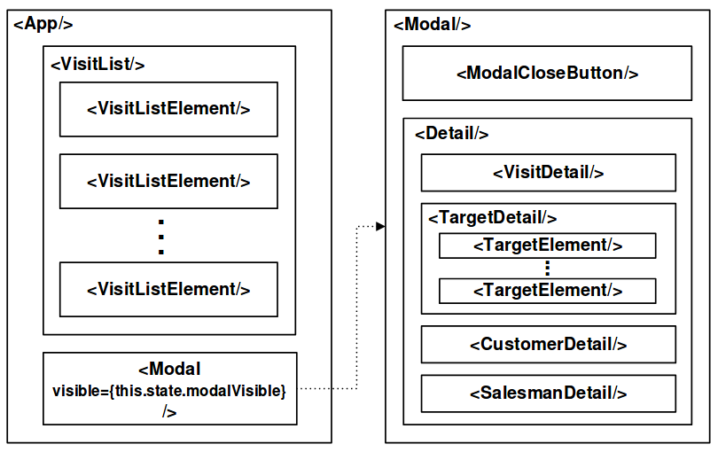

# React Native

En esta práctica se pide implementar una versión de la aplicación de [React](https://github.com/tasiomendez/react-crm). La aplicación deberá funcionar para las plataformas Android y iOS (no se utilizan componentes o funcionalidades específicas de una plataforma). Se definirán estilos para los componentes (mediante el atributo *style*) y el posicionamiento de los mismo empleando *Flexbox*.

## Comandos disponibles

* `npm start` - Arranca el servidor de desarrollo en modo desarrollador
* `npm test` - Corre todos los tests
* `npm run ios` - Como *npm start*, pero abre la aplicación en un simulador de iOS si estás en MAC y lo tienes instalado
* `npm run android` - Como *npm start*, pero abre la aplicación a un dispositivo Android conectado o en un emulador. Requiere Android build tools (Ver [React Native docs](https://facebook.github.io/react-native/docs/getting-started.html) para una instalación más detallada).

> Para desrrollar, abre la aplicación con [Expo app](https://expo.io) en tu teléfono. La aplicación se recargará cada vez que guardes los cambios, y podrás ver los errores y *logs* en la terminal.

## Comenzando a desarrollar

Antes de empezar a programar, uno debe pensar como estructurar la aplicación, y decidir _a grosso modo_ qué componentes va a necesitar y la jerarquía de los mismos. Un posible diseño es el siguiente:



La principal diferencia respecto a la estructura sugerida en la práctica anterior es que ahora el componente *Detail* se muestra mediante un componente *Modal* de React Native. Inicialmente el modal deberá estar oculto de modo que en la pantalla del dispositivo sólo se muestre el componente *VisitList*. Cuando el usuario seleccione una visita se deberá mostrar el modal con los datos de la visita seleccionada. El modal deberá tener también un botón que permita ocultarlo. Además, si el usuario pulsa el botón de retroceso del dispositivo el modal también deberá ocultarse. Para renderizar la lista de visitar, se deberá emplear el componente **FlatList** de React Native.

Al no tener la aplicación una URL (por tratarse de una aplicación nativa), se deberá eliminar la funcionalidad que permitía mapear parámetros a la URL del CRM. Por tanto, todas las peticiones al CRM serán realizadas a:

`https://dcrmt.herokuapp.com/api/visits/flattened?token=MITOKEN`

Para la realización de la práctica se recomienda: instalación de React Native, creación de una aplicación React Native inicial, modificación del fichero `App.js` y adaptación de los componentes de la aplicación React a la aplicación React Native.

## Personalizar nombre e icono

Puedes editar el archivo `app.json` para incluir [claves de configuración](https://docs.expo.io/versions/latest/guides/configuration.html).

Por ejemplo, para cambiar el nombre, utiliza la clave `expo.name` en `app.json` con una String. Para ponerle un icono a la aplicación, utiliza la etiqueta `expo.icon` con una URL local o remota. El tamaño recomendado para los iconos es de 512x512 de tipo *png* y con transparencia.

## Mejoras

Ciertas mejoras de la práctica anterior se han incorporado a esta práctica. A continuación se detallan las mejoras que han sido adaptadas de la práctica anterior.

* Integración de Redux en todas las variables de estado, exceptuando ciertas variables de estado que son locales y son únicas de ese módulo.
* Implementación de marcar visitas como favoritas, así como desmarcarlas, utilizando los métodos POST y DELETE de la API del CRM.
* Filtros para organizar las visitas mostradas, mediante el uso de una ventana Modal.
  * Se puede filtrar por periodos de tiempo.
  * Filtrar por nombre de Salesman.
  * Filtrar por nombre de Customer.
  * Mostrar favoritas.
  * Todos estos filtros se pueden combinar, para estrechar la búsqueda lo máximo posible. Haciendo click en Reset, se resetean todos los filtros de búsqueda.

Además, se han añadido las siguientes mejoras que se detallaban en el enunciado.

* **Navegación**. La aplicación se basa en dos pantallas. La primera pantalla muestra únicamente la lista de visitas. La segunda pantalla muestra los detalles de la visita seleccionada.
  
  Al seleccionar una visita de la lista mostrada en la primera pantalla, la aplicación va a la segunda pantalla y muestra los detalles de esa visita. La navegación entre pantallas se realiza mediante el componente *StackNavigator* ofrecido por la biblioteca *React Navigation*.
  
  Para enviar datos de una pantalla a otra, cuando se realiza una transición se ejecuta la siguiente llamada:
  
  ```javascript
  this.props.navigation.navigate('Info', { visit: this.props.visit })}
  ```
  
  De este modo, la pantalla destino *Info*, podrá acceder al valor en el siguiente objeto:
  
  ```javascript
  this.props.navigation.state.params.visit
  ```

* **Almacenamiento de visitas**. Cada visita, en su vista de detalles tiene un *Switch*, que te permite guardarla para consultarla sin conexión.

  La visita seleccionada se guarda mediante la API **AsyncStorage** empleando una única clave *@P7_2017_IWEB:visits* que almacena todas las visitas en un array.

  Por otro lado, podemos ver todas las visitas guardadas en una pestaña nueva que ha sido añadida utilizando un *TabNavigator* que hemos incrustado dentro del *StackNavigator*. De esta forma, podemos ver por separado las visitas guardadas y todas las visitas del CRM.

  En esa nueva pestaña, también se ha añadido un nuevo botón que te permite borrar todas las visitas guardadas con un solo toque.

## Autores

Esta práctica ha sido realizada por [Tasio Méndez Ayerbe](https://github.com/tasiomendez).
